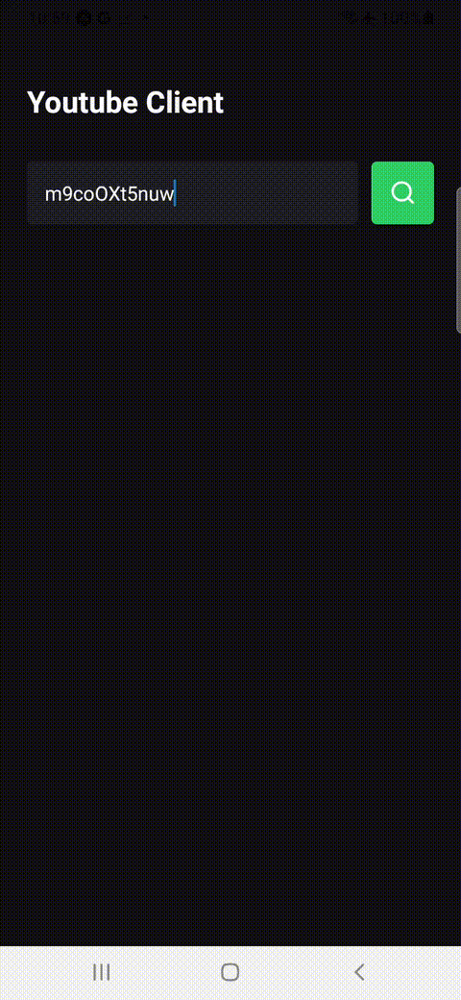

# 📲 YouTube Video Downloader App (React Native)

Este é um aplicativo móvel desenvolvido com **React Native** que atua como cliente para uma API backend que utiliza `yt-dlp` para baixar vídeos do YouTube. O objetivo principal deste projeto é **aprimorar meu conhecimento em React Native**, com foco em navegação, estado, permissões de mídia e integração com recursos nativos do Android.

## 🚀 Funcionalidades

- 📥 Permite ao usuário baixar vídeos do YouTube via link ou ID.
- 💾 Salva os vídeos diretamente na **galeria do dispositivo**, utilizando a biblioteca `expo-media-library`.
- 🔁 Acompanhamento do progresso de download com **indicador de carregamento**.
- 🔀 Navegação entre telas com `react-navigation/native-stack`.

## 📡 Backend da Aplicação

O backend responsável por fazer o download dos vídeos via `yt-dlp` está disponível neste repositório:

🔗 [https://github.com/newthiagoassisk8/ytb-api](https://github.com/newthiagoassisk8/ytb-api)

Lá você encontrará a documentação da API, exemplos de uso e instruções para rodar o servidor localmente.

## 🛠️ Tecnologias e Conceitos Explorados

- **React Native com Expo**
- **Hooks** (`useState`, `setState`)
- **React Navigation** (`@react-navigation/native-stack`)
- **expo-media-library** para acesso à mídia e integração com a camada nativa do Android
- **Permissões em tempo de execução** para salvar arquivos no armazenamento externo
- Comunicação com API REST que faz uso da biblioteca [yt-dlp](https://github.com/yt-dlp/yt-dlp)

> A biblioteca `expo-media-library` foi usada para se comunicar com a **camada nativa do Android**, permitindo que o app salve os vídeos diretamente na galeria do telefone.

## 📸 Demonstração

Confira abaixo um gif demonstrando o funcionamento do app:



## ⚙️ Como rodar o projeto

```bash
# Instale as dependências
yarn install

# Inicie o projeto
yarn start
